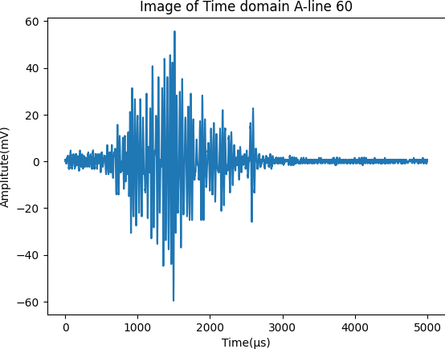
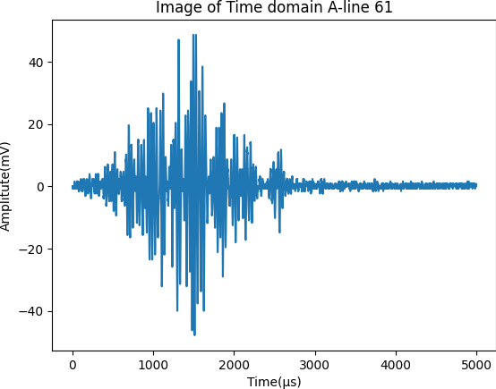
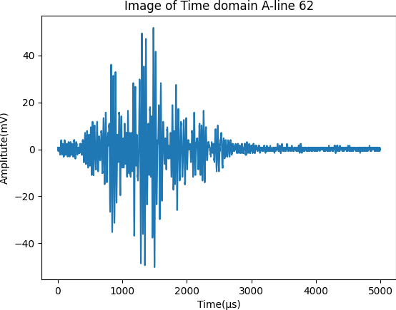
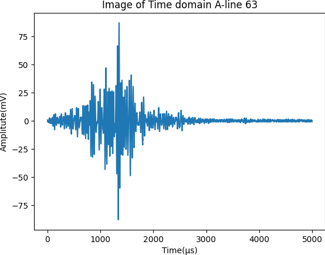
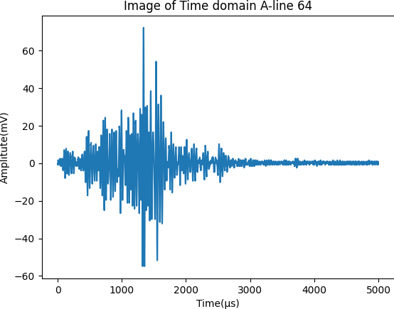
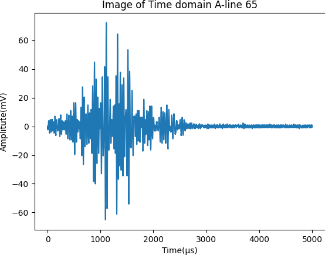
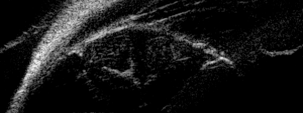
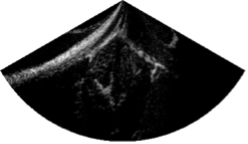

BUSHW( Biomedical UltraSound Home Work)
## Homework_1201
### Q1. Plot the 60-65th A-lines in time- and frequency-domain
| SPEC | Image                              |
|--------|------------------------------------|
| 60 Hz   |  |
| 61 Hz   |  |
| 62 Hz   |  |
| 63 Hz   |  |
| 64 Hz   |  |
| 65 Hz   |  |

### Q2. Forming a B-mode image using the original 300 lines RF data
| SPEC | Image                              |
|--------|------------------------------------|
| RAW   |  |
| Lenged   | .png) |

### Q3. Convert the B-mode image into a 120 degree sector image using the original 300 lines RF data 
| SPEC | Image                              |
|--------|------------------------------------|
| 120 degree |  |

### Q4. Interpolate the image of step 2 by assigning the nearest sample value
| SPEC | Image                              |
|--------|------------------------------------|
| 120 degree |  |
### Q5. Interpolate the image of step 2 by the linear interpolator
| SPEC | Image                              |
|--------|------------------------------------|
| 120 degree |  |
